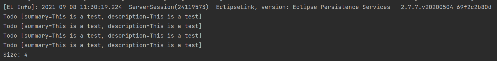
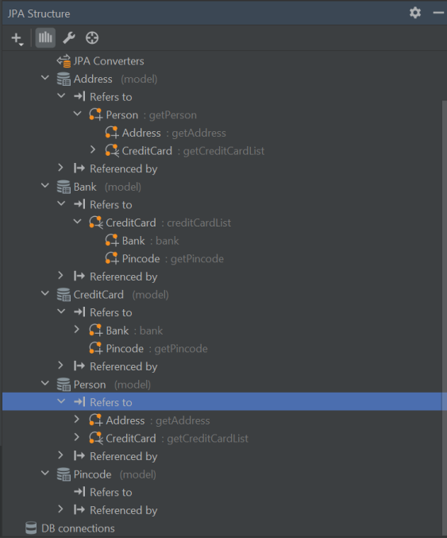

# Software Technology Experiment 2

All code used in the assignment can be found here:
https://github.com/Jethuestad/experiment-assignment-2-code.git

## Experiment 1: Application using JPA

I started with cloning the given maven project and continued with the toturial
from step 4.3. I did not encounter any problems with the first part,
but I could not manage to view the contents of the database by using a sql queuery.
I managed to make a connection with the database using derby, but when I typed
`select * from TODO` I got an error message saying that there is no table 'TODO'.

The contents printed out from the main function:

*Update: I managed to view the contents of the databse table in Intellij*

I had some trouble figuring out how to make the new project in step 6, but I
managed to get it working after some time.

## Experiment 2: Banking/Credit Card example JPA

I found it a little tricky to use jpa to create det structure and I am not sure
that I did so correctly.

I checked to JPA structure from Intellij to see if it looked like I wanted

### Issues:

 - Did not manage to view table contents from the database. However I will still
try to see if I can manage to view the contents with some help in the
lab, even though I did not get the screenshots for the assignment.
*Update: I did manage to view the contents from Intellij*
