# Software Technology Experiment 3

## Installation

The installation process went smoothly, and I did not encounter any problems.

Here is the validation of the installation package:
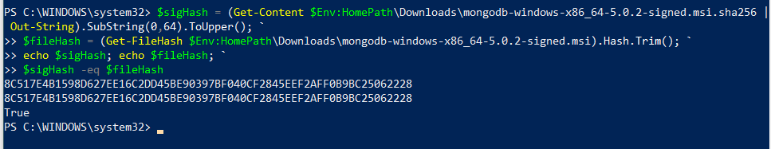

## Experiment 1: MongoDB CRUD operations
Below you can find screenshots of the main parts in each different CRUD
operation tutorial.

### Insert
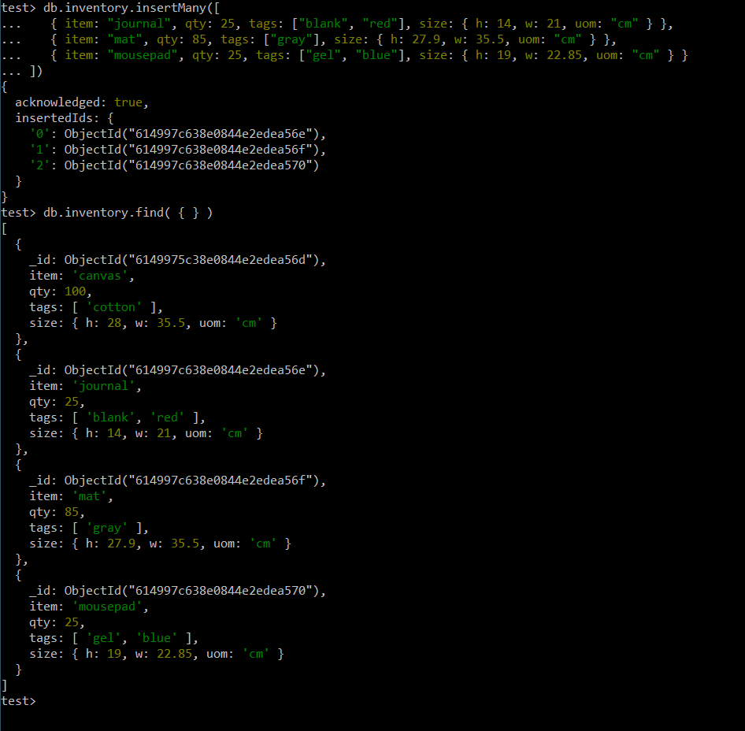

### Query
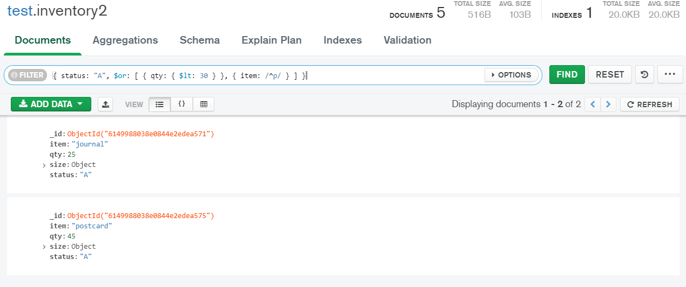

### Update
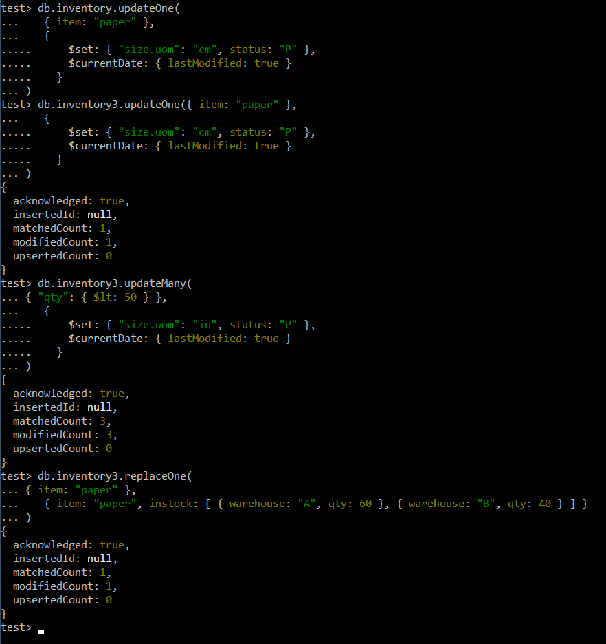
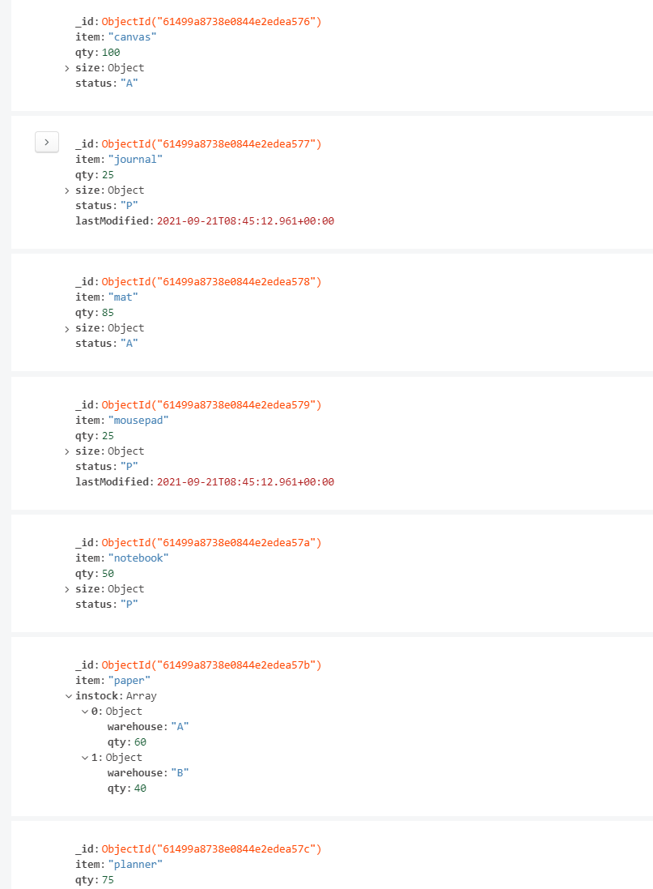

### Remove
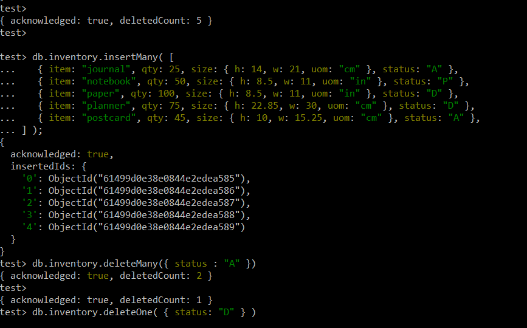

### Bulk write
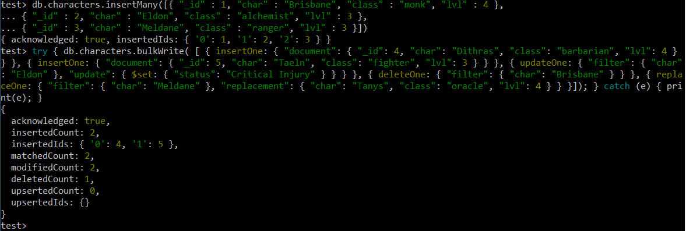

## Experiment 2: Aggregation

### Working example

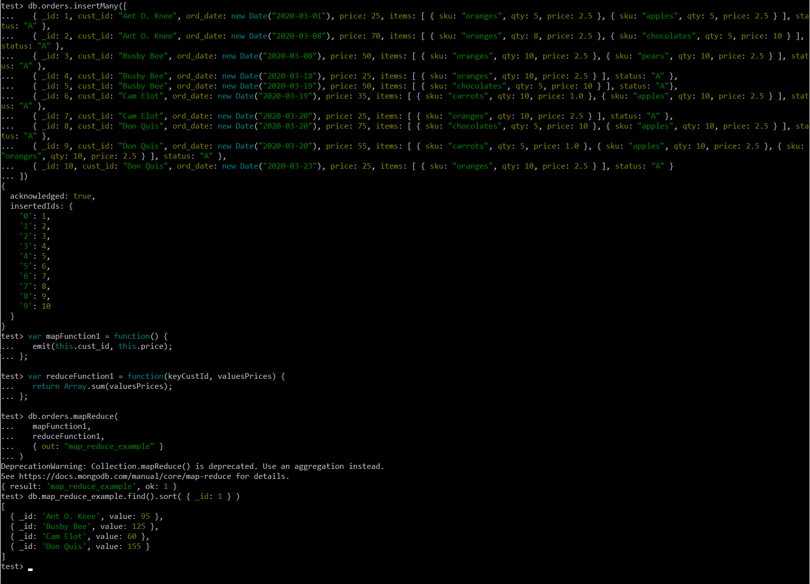
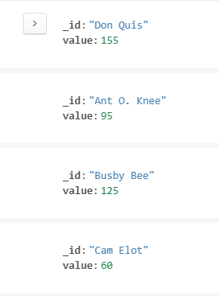

### My own Map-reduce operation

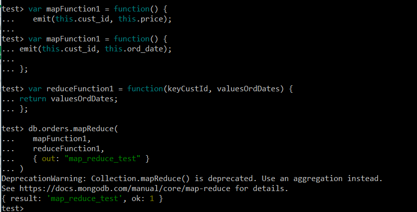
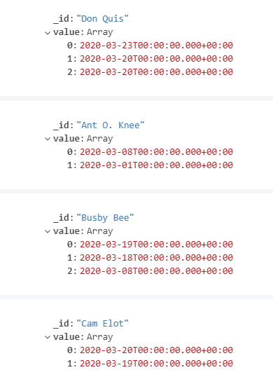

This Map-reduce operation is usefull in order to see what dates each person
ordered something. This can be used to keep track of when someone bought
something.

In the collection you get an id which is the name of each person,
and a value which contains a list over all the times that person bought
items.

## Issues

I did not encounter any issues with this experiment.
