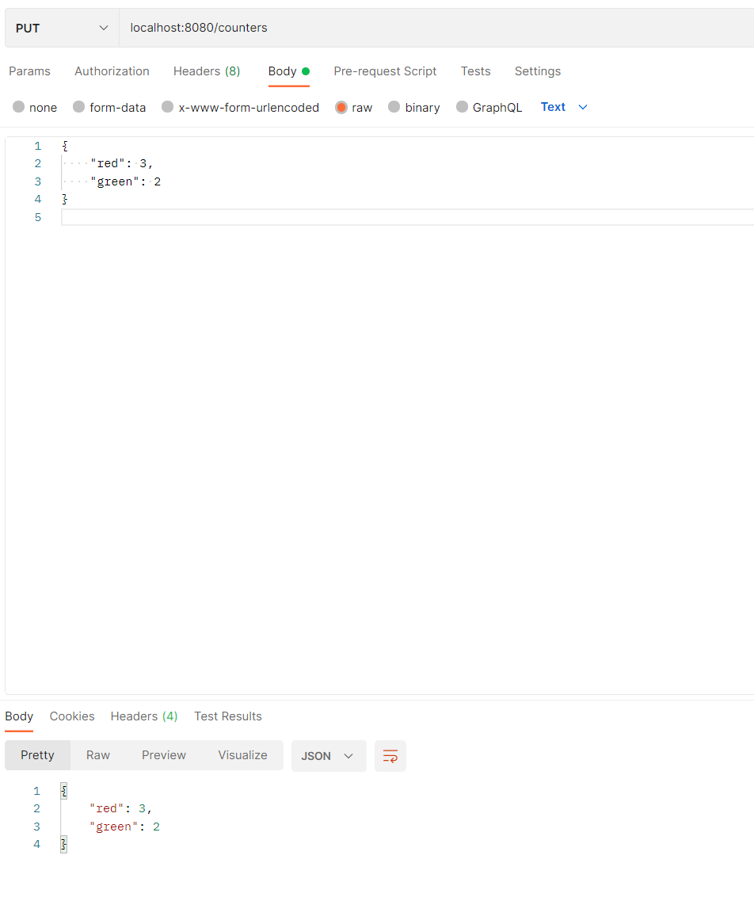
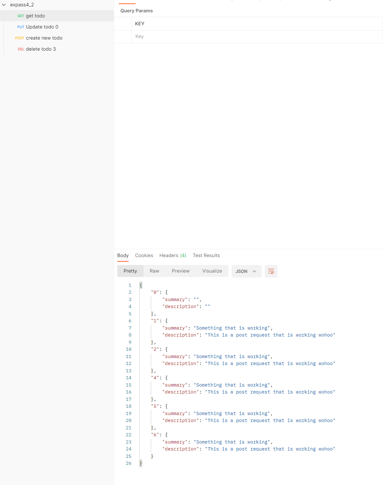

# Software Technology Experiment 4

## Installation

I did not have any problems with importing the project or setting up postman.

## Experiment 1: Spark/Java Framework project and Postman
I had no problems with the testing in experiment 1 with postman

## Experiment 2: REST API for TODO-items
This experiment was also rather straight forward and I had no difficulties while doing the tasks.

Below you can find some screen shots of the different requests:

This is after running the request some times, and then get in the end to see all todo objects:

## Issues

I did not encounter any issues with this experiment.
