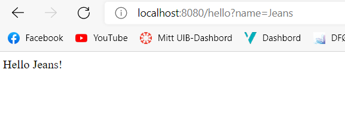
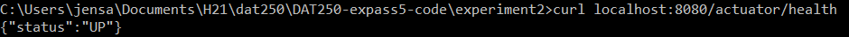
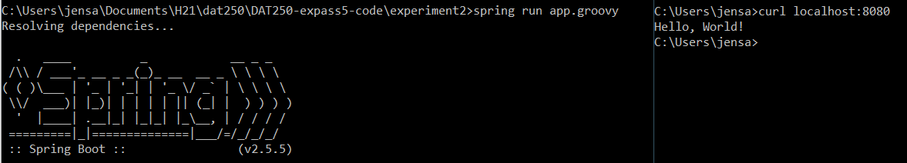
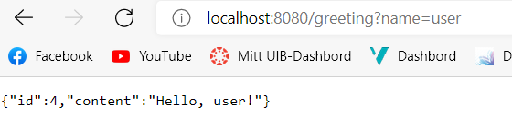
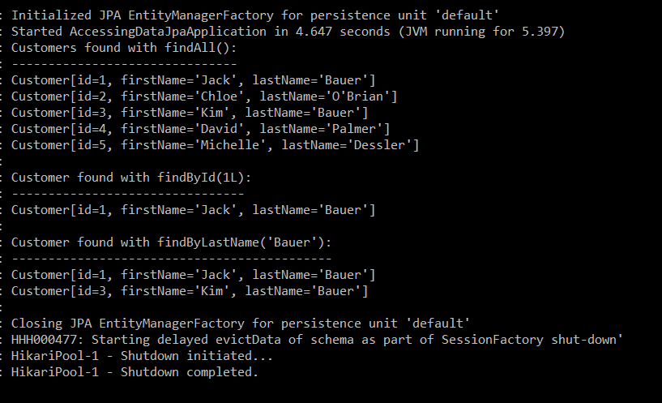

# Software Technology Experiment 5

## Installation

I did not have any problems with installing. However, I installed Scoop in order to install
the Spring CLI tool as I figured that would be the easiest way to do it.

## Experiment 1: Getting started

Picture of results after first experiment:

## Experiment 2: Spring Boot

Screenshots of results after experiment 2:

Testing the actuator/health:

Result from the groovy app:

## Experiment 3: REST service

Screenshots of results after experiment 2 using "user" as name parameter:

## Experiment 4: Data Access

Screenshots of results after experiment 4:

## Code

This is the link to my code for experiment 2:

https://github.com/Jethuestad/DAT250-expass5-code.git

## Issues

I did not encounter any issues with this experiment.
