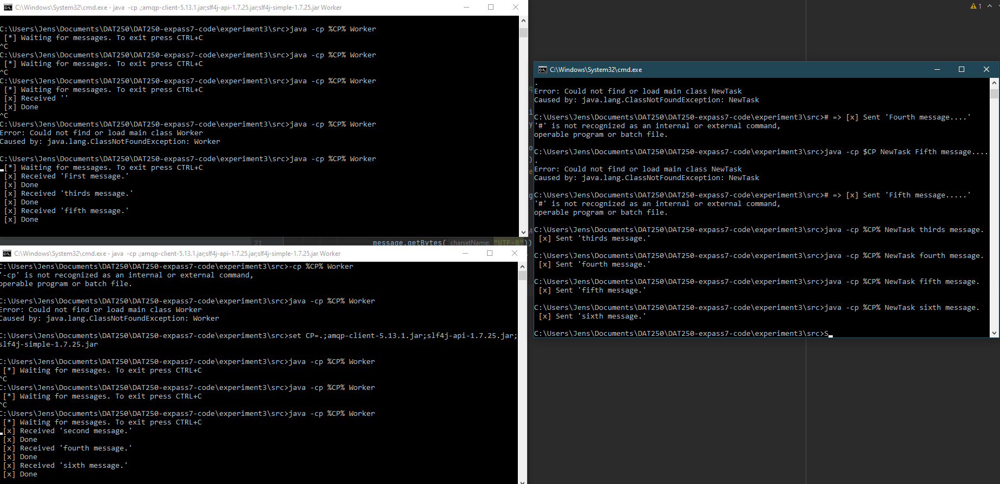
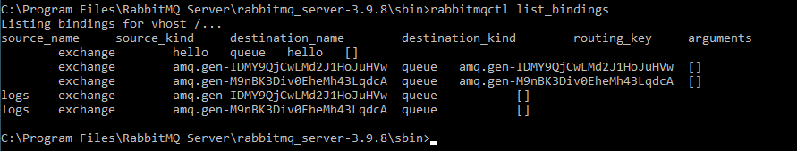

# Software Technology Experiment 7

## Installation

The installation process was smooth and I did not have any problems at all.

## Code

This is the link to my code for experiments 2, 3 and 4:

<https://github.com/Jethuestad/DAT250-expass7-code.git>

Screen shot of multiple workers recieving tasks from experiment 3:

Screen shot of bindings and queues working properly from experiment 4:

## Issues

I had some issues with launching the programs from cmd in windows.
My problem was that i typed the wrong versions of the .jar files and used
`$CP` for classpath instead if `%CP%` for defining the classpath. After
resolving those issues, everything else was fine.
